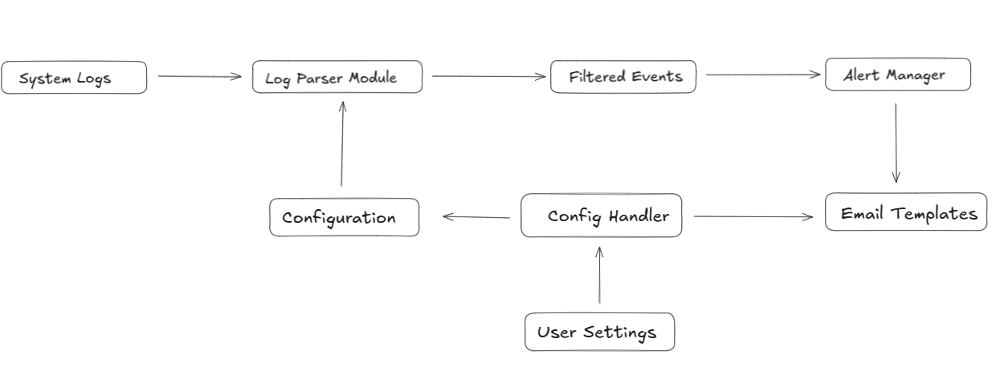
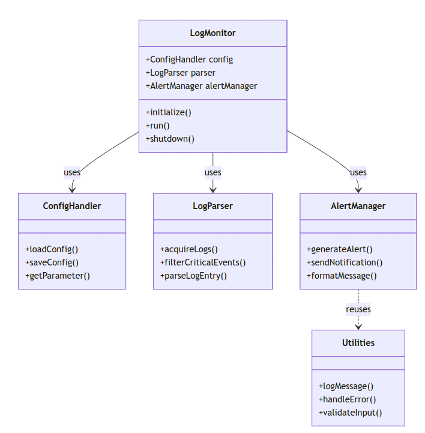
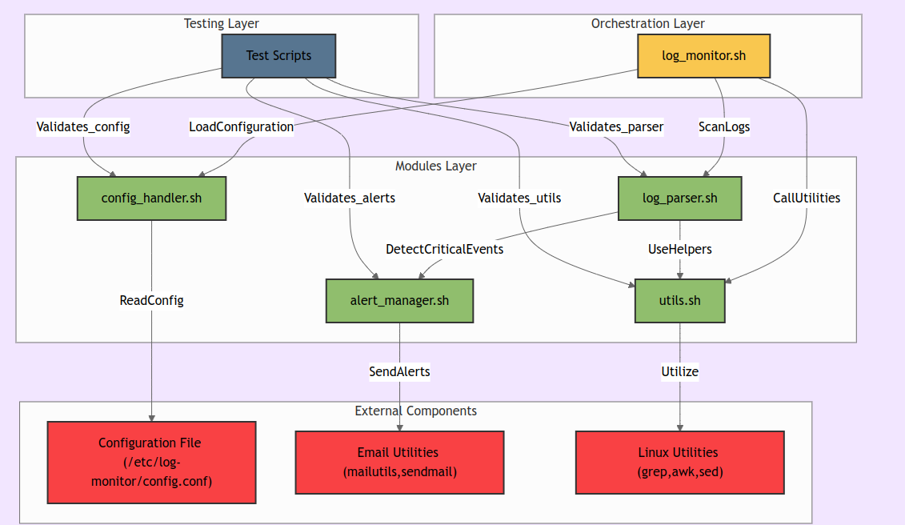
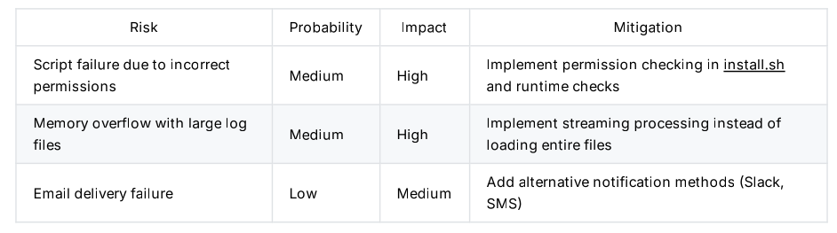
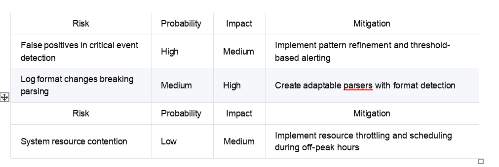

# Log Monitoring System

A modular, efficient log monitoring system for Linux environments that scans system logs, filters critical events, and sends email alerts.

## Features

- Automated monitoring of multiple log sources
- Configurable pattern matching for critical event detection
- Email notifications for critical events
- Modular architecture with high cohesion and low coupling
- Comprehensive error handling and logging
- Performance optimized for large log files

## Requirements

- Bash 4.0+
- Linux-based operating system
- Mail utilities (mailutils, sendmail)
- Standard Linux utilities (grep, awk, sed)

## Installation

1. Clone this repository:
 - git clone https://github.com/gautam-cpp/log-monitor.git
 - cd log-monitor


2. Run the installation script:
 - sudo ./install.sh


3. Configure the system by editing the configuration file:
 - sudo nano /etc/log-monitor/config.conf


4. Test the installation:
 - sudo /opt/log-monitor/log_monitor.sh --test


## Usage

The log monitoring system runs automatically via cron job after installation. You can also run it manually:
sudo /opt/log-monitor/log_monitor.sh


### Command Line Options

- `--test`: Run in test mode without sending alerts
- `--verbose`: Enable detailed console output
- `--config=/path/to/config`: Use alternative configuration file

## Configuration

The system is configured via `/etc/log-monitor/config.conf`. Key settings include:

- `LOG_SOURCES`: Space-separated list of log files to monitor
- `CRITICAL_PATTERNS`: Patterns that trigger alerts
- `EMAIL_RECIPIENT`: Where to send alert emails
- `CHECK_INTERVAL`: How often to run checks (in minutes)

See the example configuration file for more options.


## Task 1  Software Design Documentation for a Linux-Based Automation System

### Problem Selection: Automated Log Monitoring System

### Software Design Principles Application

## Abstraction

```
Log acquisition
Pattern matching and filtering
Alert generation
Notification delivery
```
## Encapsulation

```
acquire_logs(): Retrieves logs from specified sources
filter_critical_events(): Identifies critical events based on patterns
generate_alert(): Creates formatted alert messages
send_notification(): Delivers alerts via email
```

The system will be divided into independent, reusable modules:

## Modularity
The system will be divided into independent, reusable modules:


- log_parser.sh: Handles log acquisition and filtering
- alert_manager.sh: Manages alert generation and delivery
- config_handler.sh: Manages configuration settings
- utils.sh: Contains utility functions shared across modules
## Cohesion & Coupling

```
High Cohesion: Each module will focus on a single responsibility
Low Coupling: Modules will interact through well-defined interfaces, minimizing
dependencies
```
## Software Architecture Document SAD
## Data Flow Diagram DFD



## Class Diagram Bash Function Organization)


## Deployment Design
Installation instructions:


1)  Clone repository to /opt/log-monitor/
2) Run install.sh to set up dependencies:

```
 sudo apt-get install mailutils sendmail
 ```

3) Configure settings in /etc/log-monitor/config.conf
2) Set up cron job to run the monitor periodically:
```
*/10 * * * * /opt/log-monitor/run_monitor.sh
```
## Task 2  Shell Script Implementation with Modular Approach

## Main Script (log_monitor.sh)


```
#!/bin/bash
# Log Monitoring System
# Version: 1.
# Date: April 1, 2025
# Source modules
source "$(dirname "$0")/modules/config_handler.sh"
source "$(dirname "$0")/modules/log_parser.sh"
source "$(dirname "$0")/modules/alert_manager.sh"
source "$(dirname "$0")/modules/utils.sh"
# Initialize logging
LOG_FILE="/var/log/log_monitor.log"
CONFIG_FILE="/etc/log-monitor/config.conf"
# Main function
main() {
log_message "INFO" "Starting log monitoring system"
# Load configuration
if! load_config "$CONFIG_FILE"; then
log_message "ERROR" "Failed to load configuration"
exit 1
fi

# Get log sources from config
log_sources=$(get_parameter "LOG_SOURCES")
patterns=$(get_parameter "CRITICAL_PATTERNS")
email_recipient=$(get_parameter "EMAIL_RECIPIENT")
# Process each log source
for source in $log_sources; do
log_message "INFO" "Processing log source: $source"
# Acquire and filter logs
filtered_events=$(filter_critical_events "$source" "$patterns")
# Check if critical events were found
if [ -n "$filtered_events" ]; then
log_message "WARNING" "Critical events detected in $source"
# Generate and send alert
alert=$(generate_alert "$source" "$filtered_events")
if send_notification "$email_recipient" "Critical System Alert" "$alert"; the
log_message "INFO" "Alert sent successfully to $email_recipient"
else
log_message "ERROR" "Failed to send alert to $email_recipient"
fi
else
log_message "INFO" "No critical events detected in $source"
fi
done
log_message "INFO" "Log monitoring completed successfully"
}
# Error handling with trap
trap 'log_message "ERROR" "Script execution interrupted"; exit 1' ERR INT TERM
# Execute main function
main
```
## Module: config_handler.sh
```
#!/bin/bash
# Configuration handling module
# Load configuration from file
load_config() {
local config_file="$1"
if [! -f "$config_file" ]; then
return 1
fi
# Export all variables from config file
set -a
source "$config_file"

set +a
return 0
}
# Get parameter from loaded configuration
get_parameter() {
local param_name="$1"
local param_value="${!param_name}"
echo "$param_value"
}
# Save parameter to configuration
save_parameter() {
local config_file="$1"
local param_name="$2"
local param_value="$3"
# Check if parameter exists
if grep -q "^$param_name=" "$config_file"; then
# Update existing parameter
sed -i "s/^$param_name=.*/$param_name=$param_value/" "$config_file"
else
# Add new parameter
echo "$param_name=$param_value" &gt;&gt; "$config_file"
fi
}
```
## Module: log_parser.sh
```
#!/bin/bash
# Log parsing module
# Acquire logs from specified source
acquire_logs() {
local log_source="$1"
local time_window="$2"
# Default to last hour if not specified
time_window=${time_window:-"1 hour ago"}
# Use journalctl for systemd logs or cat for file logs
if [[ "$log_source" == "systemd" ]]; then
journalctl --since "$time_window"
else
# For regular log files, use grep with timestamp
if [ -f "$log_source" ]; then
current_date=$(date +"%b %d")
grep "$current_date" "$log_source"
else
echo "Log source not found: $log_source"
return 1
fi

fi
}
# Filter critical events based on patterns
filter_critical_events() {
local log_source="$1"
local patterns="$2"
# Get logs from source
local logs=$(acquire_logs "$log_source")
# Check if logs were acquired successfully
if [ $? -ne 0 ]; then
log_message "ERROR" "Failed to acquire logs from $log_source"
return 1
fi
# Filter logs based on patterns
local filtered_logs=""
for pattern in $patterns; do
local pattern_matches=$(echo "$logs" | grep -i "$pattern")
if [ -n "$pattern_matches" ]; then
filtered_logs+="$pattern_matches\n"
fi
done
# Remove duplicate entries
echo -e "$filtered_logs" | sort | uniq
}
# Parse log entry into structured format
parse_log_entry() {
local log_entry="$1"
# Extract timestamp, severity, and message
local timestamp=$(echo "$log_entry" | awk '{print $1" "$2" "$3}')
local severity=$(echo "$log_entry" | grep -o -E 'ERROR|WARNING|CRITICAL|FATAL' | head
local message=$(echo "$log_entry" | cut -d' ' -f4-)
# Default severity if not found
severity=${severity:-"UNKNOWN"}
# Return structured format
echo "TIMESTAMP: $timestamp"
echo "SEVERITY: $severity"
echo "MESSAGE: $message"
}
```
## Module: alert_manager.sh
```
#!/bin/bash
# Alert management module
# Generate alert message

generate_alert() {
local source="$1"
local events="$2"
# Create formatted alert message
local alert="Critical events detected in $source at $(date):\n\n"
# Process each event
while IFS= read -r event; do
# Skip empty lines
[ -z "$event" ] &amp;&amp; continue
# Parse the event
local parsed=$(parse_log_entry "$event")
alert+="$parsed\n---\n"
done &lt;&lt;&lt; "$events"
# Add footer
alert+="\nThis is an automated alert from the Log Monitoring System."
echo -e "$alert"
}
# Send notification via email
send_notification() {
local recipient="$1"
local subject="$2"
local message="$3"
# Validate inputs
if [ -z "$recipient" ] || [ -z "$subject" ] || [ -z "$message" ]; then
log_message "ERROR" "Missing parameters for notification"
return 1
fi
# Send email using mail command
echo -e "$message" | mail -s "$subject" "$recipient"
# Check if mail command was successful
if [ $? -eq 0 ]; then
return 0
else
return 1
fi
}

#!/bin/bash
# Utility functions module
# Log message to file
log_message() {
local level="$1"
```
## Module: utils.sh
```
#!/bin/bash
# Utility functions module
# Log message to file
log_message() {
local level="$1"local message="$2"
local timestamp=$(date +"%Y-%m-%d %H:%M:%S")
# Ensure LOG_FILE is defined
if [ -z "$LOG_FILE" ]; then
LOG_FILE="/var/log/log_monitor.log"
fi
# Create log directory if it doesn't exist
local log_dir=$(dirname "$LOG_FILE")
if [ ! -d "$log_dir" ]; then
mkdir -p "$log_dir"
fi
# Write to log file
echo "[$timestamp] [$level] $message" &gt;&gt; "$LOG_FILE"
# Print to console if verbose mode is enabled
if [ "${VERBOSE:-0}" -eq 1 ]; then
echo "[$timestamp] [$level] $message"
fi
}
# Handle errors
handle_error() {
local error_code="$1"
local error_message="$2"
log_message "ERROR" "Error $error_code: $error_message"
# Send error notification if configured
if [ -n "${ERROR_NOTIFICATION_EMAIL:-}" ]; then
send_notification "$ERROR_NOTIFICATION_EMAIL" "Log Monitor Error" "Error $error_c
fi
# Exit with error code
exit "$error_code"
}
# Validate input parameters
validate_input() {
local input="$1"
local pattern="$2"
local error_message="$3"
if ! echo "$input" | grep -q "$pattern"; then
log_message "ERROR" "$error_message"
return 1
fi
return 0
}
```

## Task 3  Implementation of Software Configuration Management SCM

## Git Repository Structure


## Branching Strategy

- Main: Stable production code
- Develop: Integration branch for features
- Feature/X: Individual feature branches
- Bugfix/X: Bug fix branches
- Release/X.Y: Release preparation branches

## Git Workflow

### 1). Create feature branch from develop:
```
git checkout develop
git pull
git checkout -b feature/log-filtering
```
### 2). Implement changes and commit:
```
git add modules/log_parser.sh
git commit -m "Implement advanced log filtering with regex patterns"
```
### 3). Push feature branch and create pull request:
```
git push origin feature/log-filtering
```

### 4). After code review, merge to develop:
```
git checkout develop
git merge --no-ff feature/log-filtering
git push origin develop
```
### 5). Prepare release:
```
git checkout -b release/1.
# Version bumping and final testing
git checkout main
git merge --no-ff release/1.
git tag -a v1.0 -m "Version 1.0"
git push origin main --tags
```
## Version Control Strategy

```
Semantic versioning MAJOR.MINOR.PATCH
Version information stored in VERSION file
CHANGELOG.md updated with each release
Git tags for each release version
```
# Task 4 - Performance Testing and Risk Management

## Performance Testing

## Testing Tools


### 1). Shell Script Analysis:
- ShellCheck for static code analysis
- BATS (Bash Automated Testing System) for unit testing
### 2). Performance Monitoring:
- time command to measure execution time
- htop for CPU and memory usage
- iostat for I/O performance

## Test Cases

### 1) Unit Tests:
```
load '../modules/log_parser.sh'
load '../modules/utils.sh'@test "filter_critical_events finds ERROR patterns" {
result=$(filter_critical_events "test_data/sample.log" "ERROR")
[ -n "$result" ]
[[ "$result" == *"ERROR"* ]]
}
@test "parse_log_entry extracts correct components" {
entry="Apr 1 10:15:30 server kernel: ERROR: Out of memory"
result=$(parse_log_entry "$entry")
[[ "$result" == *"TIMESTAMP: Apr 1 10:15:30"* ]]
[[ "$result" == *"SEVERITY: ERROR"* ]]
[[ "$result" == *"MESSAGE: server kernel: ERROR: Out of memory"* ]]
}
```
### 2) Performance Tests:
```

# Measure execution time
time ./log_monitor.sh
# Monitor resource usage
/usr/bin/time -v ./log_monitor.sh
```
### 3). Load Testing:
- Test with large log files (>1GB)
- Test with high-frequency log generation

## Risk Management
### Technical Risks

### Operational Risks



## Risk Mitigation Strategies


### Defensive Programming:
- Input validation for all parameters
- Comprehensive error handling
- Graceful degradation when components fail
### Monitoring and Alerting:
- Self-monitoring capabilities
- Health check endpoints
- Performance metrics collection
### Documentation and Training:
- Detailed installation and troubleshooting guides
- Regular knowledge sharing sessions
- Incident response procedures
### Continuous Improvement:
- Regular code reviews
- Automated testing in CI/CD pipeline
- Post-incident analysis and improvements


## Contributors ✨

Thanks to these amazing people who contributed to this project:

| Contributor | Profile |
|------------|---------|
| [Sumedhvats](https://github.com/Sumedhvats) | <a href="https://github.com/Sumedhvats"></a> |
| [Mohit137c](https://github.com/Mohit137c) | <a href="https://github.com/Mohit137c"></a> |
| [Vivek-Anand727](https://github.com/Vivek-Anand727) | <a href="https://github.com/Vivek-Anand727"></a> |


